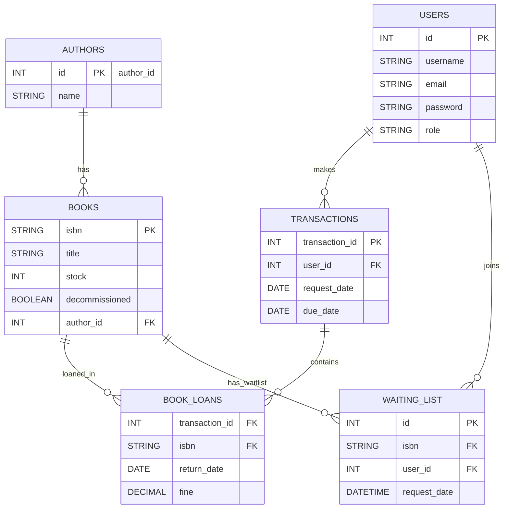

# Database Diagram

The diagram below shows the main database entities and relationships used by the application. It's written in Mermaid ER syntax; many readers and tools (GitHub, VS Code extensions) can render it directly.

Notes:
- The `BOOK_LOANS` table uses a composite key (`transaction_id`, `isbn`) in the application model.
- Field names reflect the domain model; consult `src/main/resources/db/migration` for exact schema DDL.
